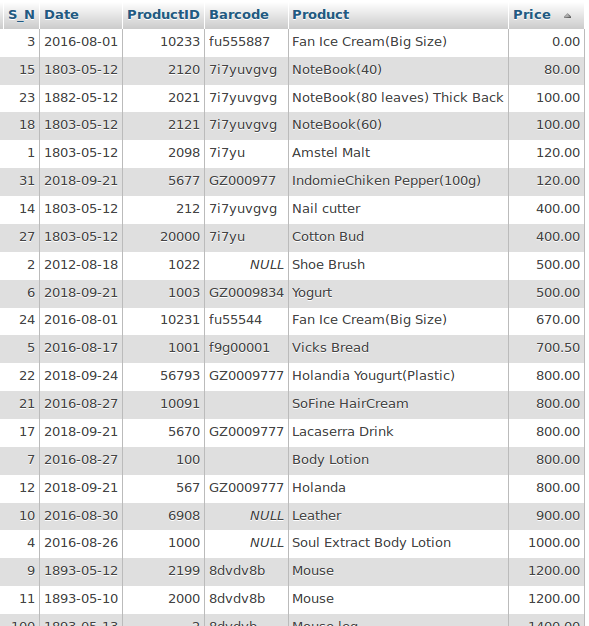

# Peagasus
## Inventory management Software

PGS (Pegasus) is purely a Java developed Software designed  for Inventory Stores. The Software features an administrator panel, cashier's view and many more

Although it's sill being developed but i just think it's one that the entire ***Java** community might find interesting.
It aims to be something unique that would have attention than others. SO designs and Functionally  are Key to this project.

# Databases
There is just one table for now on this project which is the product table.
The Acces right ont the table is restricted in some areas o the receptionist/cashier as the case may be. ut it's completely accessible to the administrator.
Below is a markdown of how the image of the database looks like

## Designs
Well for the designs i would really appreciate some help in making it look nice.

## NOTE:
1) As of the time of upload there was no MVC implemented in this projects
